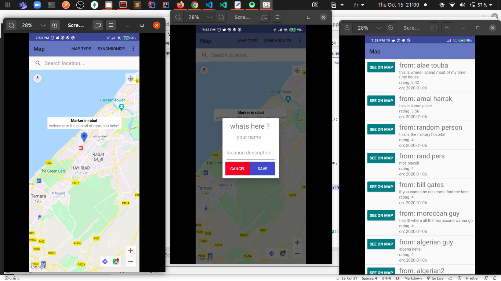
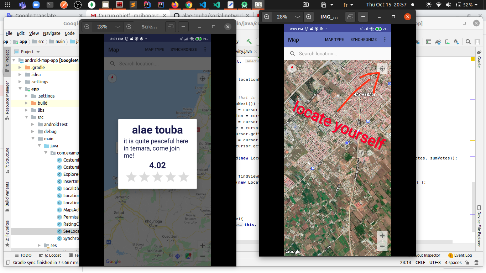

# Table of content

-   **[About](#about)**
-   **[Features](#features)**
-   **[Use It Locally](#use-it-locally)**
-   **[Screenshots](#screenshots)**

<a name="about"></a>

# About

I created this app in the first semester of my masters (last year(2019)), as a project for a class named _android programming_.

This app is written in Java.

It is built using the Google Map API, it has a local SQLite database and it is connected to an online PHP/MySQL database.

<a name="features"></a>

# Features

-   Users can save places they visit/like, with a description and a rating in the online db
-   Users can see all the places saved by others and locate them in the map
-   Users can rate different places
-   Users can synchronise the online database and the local one, for an offline acces to data
-   Users can search locations and see/locate them in the map
-   Users can locate themselves in the map (if they are using GPS)
-   Users can change the type of the map

<a name="use-it-locally"></a>

# Use It Locally

```
# clone the repo
# open it with android studio
```

<a name="screenshots"></a>

# Screenshots




